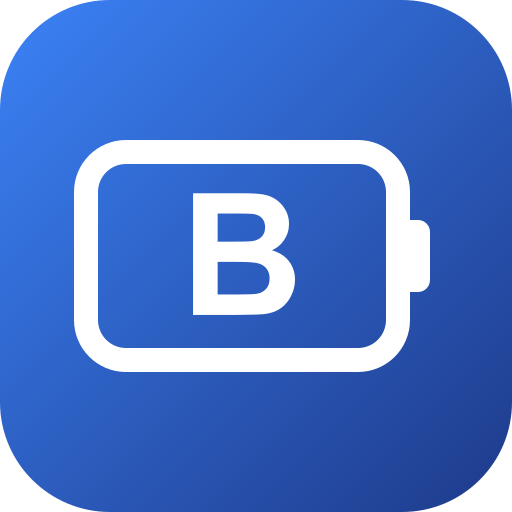

# ioBroker.bluetti-battery

**Tests:** 

## bluetti-battery adapter for ioBroker

Monitor and control Bluetti power stations / batteries over Bluetooth Low Energy
(MODBUS-over-BLE). This is a Node.js/TypeScript port of the protocol from
[bluetti_mqtt](https://github.com/warhammerkid/bluetti_mqtt), integrated directly
into ioBroker so no extra Python service or MQTT broker is required.

### Supported devices

`AC200M`, `AC200L`, `AC300`, `AC500`, `AC240`, `AC60`, `EP500`, `EP500P`,
`EP600`, `EB3A`.

Experimental (register maps ported from community forks, not verified on real
hardware): `AC180`, `AC2A`, `AC70`, and `V2` (the encrypted protocol used by
newer firmware/models).

One adapter instance talks to one device.

### Encrypted (v2) devices

Newer Bluetti units use an encrypted BLE handshake (AES-CBC + ECDH). Select the
`V2` device type, or set **Encryption** to `on`, to enable it. This support is a
port of the [nhurman fork](https://github.com/nhurman/bluetti_mqtt) and is
**experimental**: the crypto primitives are unit-tested, but the full handshake
has not been verified against real hardware. Feedback welcome.

### Requirements

- Linux host with **BlueZ** (the standard Linux Bluetooth stack). The adapter
  uses [`node-ble`](https://github.com/chrvadala/node-ble), which talks to BlueZ
  over D-Bus — it does **not** grab the HCI adapter exclusively, so it coexists
  with other BLE adapters and the system Bluetooth stack.
- The user running ioBroker needs D-Bus permission to use BlueZ. If you get
  permission errors, add a D-Bus policy for the `iobroker` user (see the
  [node-ble setup notes](https://github.com/chrvadala/node-ble#provide-permissions)).

### Configuration

| Setting | Description |
|---------|-------------|
| MAC address | Bluetooth MAC of the device, e.g. `AA:BB:CC:DD:EE:FF`. |
| Device type | `auto` detects from the advertised BLE name, or pick the model manually. |
| Polling interval | Seconds between reads (default 10). |
| Poll per-pack data | Also read per-pack cell voltages etc. (slower). |

States that map to writable MODBUS registers (e.g. `ac_output_on`,
`dc_output_on`, `ups_mode`) are created with write access; setting them sends a
`WriteSingleRegister` command to the device.

## Changelog
<!--
	Placeholder for the next version (at the beginning of the line):
	### **WORK IN PROGRESS**
-->

### **WORK IN PROGRESS**
* (Garfonso/Claude) make modbus polling more robust.
* (Garfonso/Claude) add experimental support for encrypted (v2) devices
* (Garfonso/Claude) initial release

## License
MIT License

Copyright (c) 2026 Garfonso <garfonso@mobo.info>

Permission is hereby granted, free of charge, to any person obtaining a copy
of this software and associated documentation files (the "Software"), to deal
in the Software without restriction, including without limitation the rights
to use, copy, modify, merge, publish, distribute, sublicense, and/or sell
copies of the Software, and to permit persons to whom the Software is
furnished to do so, subject to the following conditions:

The above copyright notice and this permission notice shall be included in all
copies or substantial portions of the Software.

THE SOFTWARE IS PROVIDED "AS IS", WITHOUT WARRANTY OF ANY KIND, EXPRESS OR
IMPLIED, INCLUDING BUT NOT LIMITED TO THE WARRANTIES OF MERCHANTABILITY,
FITNESS FOR A PARTICULAR PURPOSE AND NONINFRINGEMENT. IN NO EVENT SHALL THE
AUTHORS OR COPYRIGHT HOLDERS BE LIABLE FOR ANY CLAIM, DAMAGES OR OTHER
LIABILITY, WHETHER IN AN ACTION OF CONTRACT, TORT OR OTHERWISE, ARISING FROM,
OUT OF OR IN CONNECTION WITH THE SOFTWARE OR THE USE OR OTHER DEALINGS IN THE
SOFTWARE.